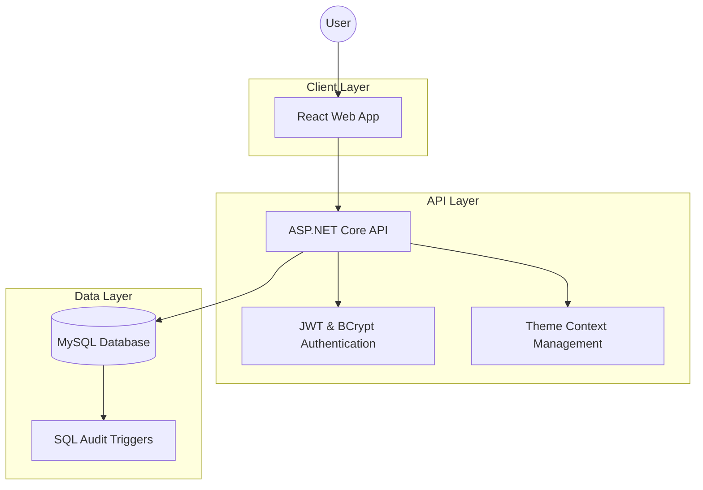

# TalaStock - Premium Inventory Management System

TalaStock is a state-of-the-art, cross-platform inventory management ecosystem. Built with a focus on speed, premium aesthetics, and robust security, it provides businesses with real-time insights into their stock levels, user activities, and financial trends.

## Key Features
- **Web-Based**: Modern web application accessible from any browser.
- **Dynamic Theming**: Instant **Dark / Light Mode** switching with a premium toggle.
- **Advanced Analytics**: Visual inventory history and trends using `recharts`.
- **Global Management**: Manage **Users**, **Categories**, and **Currencies** (multi-currency support) from a central administrative panel.
- **Premium UX**: High-performance **Glassmorphism UI** with smooth transitions.
- **Robust Security**: JWT-based authentication with BCrypt password encryption.

## System Architecture


## Documentation
For detailed information, please refer to:
- [**Technical Stack**](./TECH_STACK.md) - Deep dive into the technologies used.
- [**Features Guide**](./FEATURES.md) - Comprehensive walk-through of the app's capabilities.

## Quick Start

### 1. Database Setup
Execute the script located at `/Database/schema.sql` to initialize your MySQL database, audit triggers, and seed data.

### 2. Backend API
```bash
cd Backend
dotnet run
```
*Port: http://localhost:5223 (Admin Authorized)*

### 3. Web App
```bash
cd Frontend
npm install
npm run dev
```

## Performance & Polish
- **Optimized Rendering**: Leverages React `useMemo` for heavy data filtering and statistical calculations.
- **High-Density UI**: A compact design system that allows professional users to monitor more data at a glance.
- **ADO.Net Performance**: Direct database mapping for maximum throughput.
- **Custom UI Tweaks**: Custom scrollbar system for a polished feel.

---
